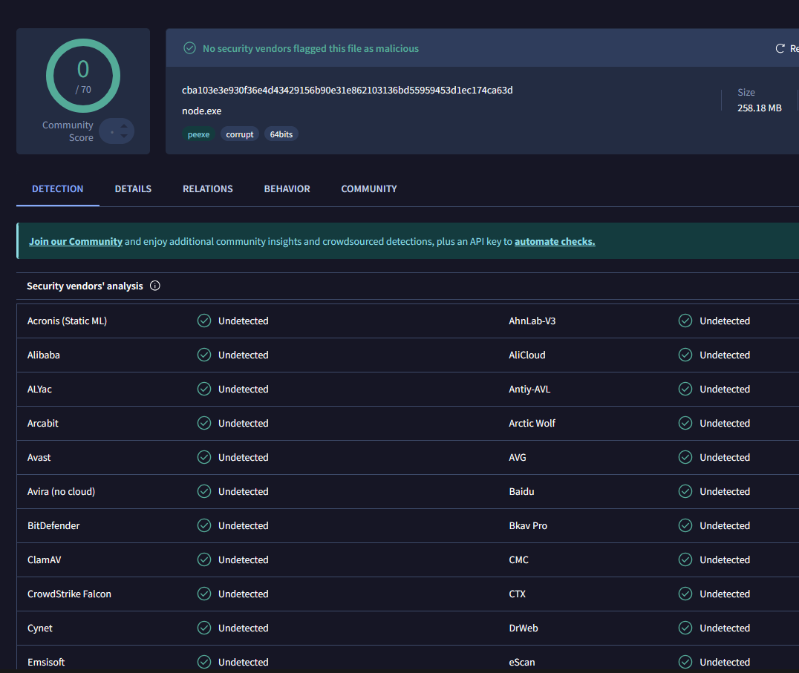
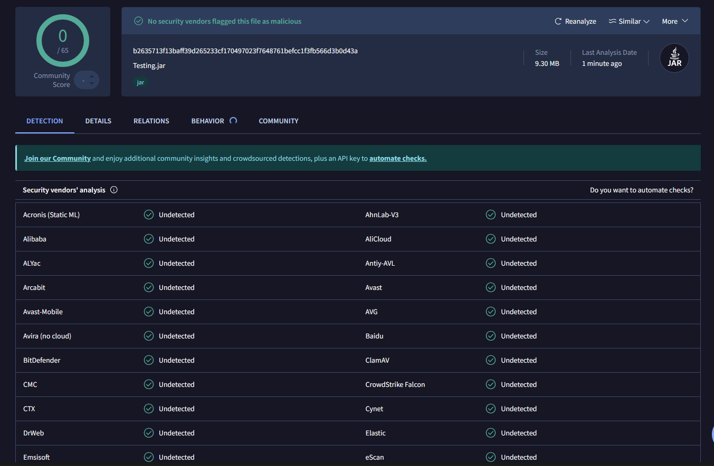
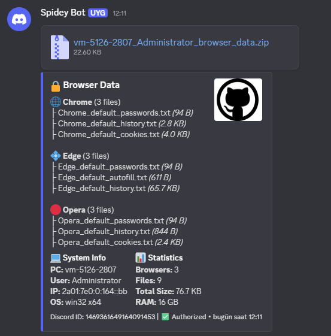

  

<h1 align="center">Slutty</h1>

  <b>Advanced Stealer Tool</b>

  <a href="https://sluttiest.space/">Website</a> •
  <a href="#features">Features</a> •
  <a href="#supported-browsers">Browsers</a> •
  <a href="#screenshots">Screenshots</a> •
  <a href="#purchase">Purchase</a>

  
  
  
  
  
  
  

  
  
  

---

## Features

| Feature | Description |
|---------|-------------|
| **Password Extraction** | Chrome, Edge, Brave, Opera, Firefox and more. DPAPI & App-Bound Key support |
| **Cookie Collection** | Session cookies, auth tokens from all browsers |
| **Credit Card & CVC** | Full card details with CVC extraction |
| **Discord Injection** | Real-time token harvesting with core module injection |
| **Browser History** | Full history with timestamps |
| **Auto ZIP & Webhook** | Automatic compression and Discord webhook delivery |

---

## Build Formats

| Format | Type | Description |
|--------|------|-------------|
| **.EXE** | Windows Native | Standalone executable, no dependencies, fastest startup |
| **.MSI** | Windows Installer | Silent install, auto startup, professional look |
| **.JAR** | Java / Cross-Platform | Runs on any system with Java, heavy obfuscation, JRE portable |

---

## Supported Browsers

### Chromium-based
- Google Chrome
- Microsoft Edge  
- Brave
- Opera / Opera GX
- Vivaldi

### Gecko-based
- Firefox
- Waterfox
- LibreWolf
- Zen Browser

---

## Screenshots

### VirusTotal Scan Result (EXE)

  

### VirusTotal Scan Result (JAR)

  

### Discord Webhook Output

  

---

## Technical Details

- **Multiple Build Formats** - EXE, MSI, and JAR support
- **Java Build** - Cross-platform JAR with heavy obfuscation (Skidfuscator)
- **Single Executable** - No dependencies, runs immediately
- **Anti-Detection** - Advanced evasion techniques

---

## Purchase

Get your personalized build with webhook integration.

| Package | Builds | Price |
|---------|--------|-------|
| **Weekly** | Unlimited | $25 |
| **Monthly** | Unlimited | $40 |
| **Yearly** | Unlimited | $150 |
| **Source Code** | Ready to go | $2000 |

  
  
  

---

## Disclaimer

This tool is provided for **educational purposes only**. The developers are not responsible for any misuse or damage caused by this software. Use at your own risk and comply with all applicable laws.

---

  <b>© 2026 Slutty</b> 
  Made for cybersecurity education

